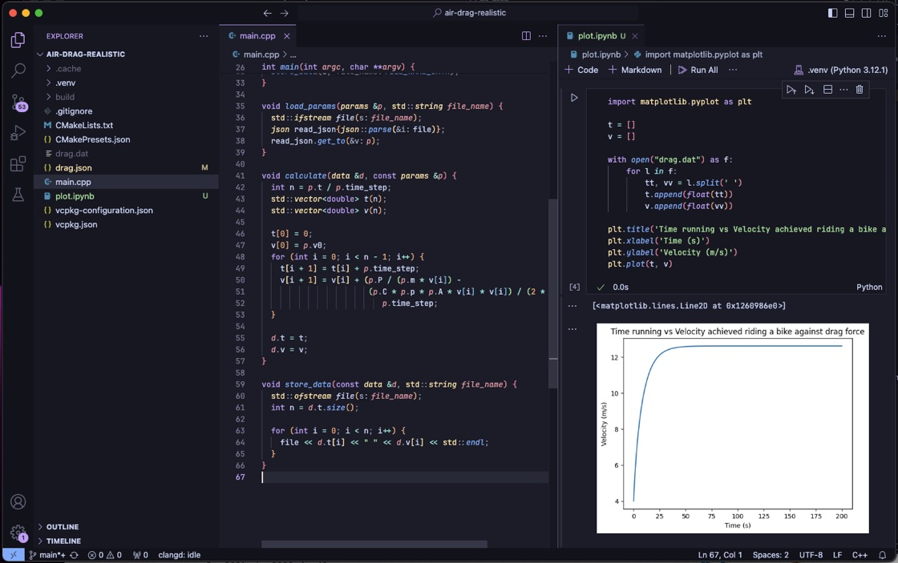

# Realistic Air Drag Force Simulation

Simulates a rider going full potential against air resistance, using a simple Euler’s method approach.

Results show how velocity got stuck at some point. The rider would need to reduce this drag force somehow to keep up that speed or even improve it (perhaps obviously, with better bike aerodynamics, hence reduced frontal area of air contact).
